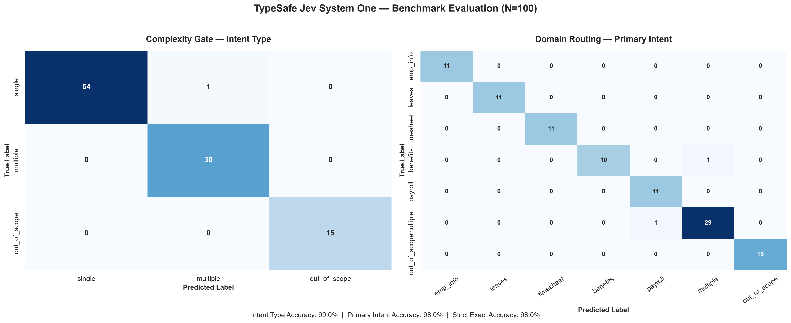

# Jev System One HR Routing Benchmark

A reproducible evaluation suite benchmarking TypeSafe AI's **Jev (`system_one`)** as a low-latency, deterministic System 1 classification gate for multi-agent HR and payroll systems.

The benchmark evaluates whether Jev can reliably determine **intent complexity** and **routing destination** before deciding whether a request should be dispatched directly to a specialized worker or escalated to a reasoning LLM.

---

## 1. Architecture

Agentic systems often invoke generative frontier LLMs for basic classification and routing decisions. This introduces additional latency, token usage, and cost for tasks that can potentially be handled by a bounded classifier.

This benchmark evaluates a hybrid **System 1 + System 2** architecture:

```text
                           User Query
                               |
                               v
                  +--------------------------+
                  |   Jev System One Gate    |
                  | (Non-autoregressive RLCD)|
                  +-------------+------------+
                                |
             +------------------+------------------+
             |                                     |
        Single Intent                         Multi-Intent
     (High Confidence)                       OR Low Margin
             |                                     |
             v                                     v
      Direct Dispatch                       Escalate to LLM
    (Domain Worker Tool)                 (Planning & Synthesis)
             |                                     |
   +---------+---------+                  +--------+--------+
   |         |         |                  |                 |
Employee    Leaves   Timesheet          Benefits          Payroll
Worker     Worker    Worker             Worker            Worker
```

### System 1 — Jev

Jev acts as the fast classification gate.

The benchmark evaluates two classification dimensions:

1. **Intent cardinality**
   - `single`
   - `multiple`
   - `out_of_scope`

2. **Primary routing target**
   - `employee_information`
   - `leaves`
   - `timesheet`
   - `benefits`
   - `payroll`
   - `multiple`
   - `out_of_scope`

The intended role of Jev is **classification and routing**, not general-purpose reasoning.

### System 2 — Reasoning LLM

A reasoning LLM can be invoked when a request requires:

- Cross-domain task decomposition
- Dependency resolution
- Multi-step execution
- Planning
- Synthesis across worker results
- Ambiguous or low-confidence routing

The architectural goal is therefore:

> Use a fast bounded classifier for simple routing decisions and reserve expensive generative reasoning for requests that actually require reasoning.

---

# 2. Benchmark Dataset

The benchmark uses a **100-query golden dataset** containing enterprise HR practitioner queries across three operational segments.

| Query Type | Identifier | Sample Size | Description |
| :--- | :--- | ---: | :--- |
| **Single Intent** | `S001`–`S055` | 55 | Clean single-domain requests |
| **Multi-Intent** | `M001`–`M030` | 30 | Cross-domain inquiries spanning 2–3 domains |
| **Out of Scope** | `O001`–`O015` | 15 | Non-HR enterprise queries used to test abstention |

## Single-Intent Distribution

The 55 single-intent queries are balanced equally across five HR domains:

| Domain | Queries |
| :--- | ---: |
| `employee_information` | 11 |
| `leaves` | 11 |
| `timesheet` | 11 |
| `benefits` | 11 |
| `payroll` | 11 |
| **Total** | **55** |

## Multi-Intent Queries

The 30 multi-intent examples contain combinations of two or three HR domains.

Examples include:

```text
timesheet | payroll
employee_information | leaves
employee_information | leaves | benefits
benefits | payroll
```

These queries are intended to test whether Jev can recognize when a request should not be blindly dispatched to a single worker.

## Out-of-Scope Queries

The 15 out-of-scope examples contain enterprise requests outside the HR routing taxonomy, including areas such as:

- IT support
- Hardware
- SSO
- VPN
- Facilities
- Legal
- Software engineering

These examples test Jev's ability to abstain rather than incorrectly route an unrelated request to an HR worker.

---

# 3. Dataset Schema

The golden dataset contains the following fields:

```text
id
query
level
domain
intent_type
intent
intents
```

Example:

```csv
id,query,level,domain,intent_type,intent,intents
S001,What is John's employment status?,easy,employee_information,single,employee_information,none
M001,John's benefits changed and his paycheck is different. Can you check his current benefits and explain his pay information?,hard,cross_domain,multiple,multiple,benefits|payroll
O001,My work laptop screen is flickering and the keyboard stopped responding. Can you help me order a replacement?,easy,out_of_scope,out_of_scope,out_of_scope,none
```

---

# 4. Repository Structure

The benchmark is implemented as a **Jupyter notebook** rather than a collection of Python scripts.

```text
jev-experiment/
│
├── data/
│   └── golden_dataset.json
│
├── jev-intent-classification.ipynb
│
├── classification_results.json
├── benchmark_summary.json
├── misclassified_queries.csv
├── benchmark_confusion_matrices.png
│
├── pyproject.toml
├── uv.lock
│
├── .env
├── .env.example
├── .gitignore
│
└── README.md
```

### Key Files

| File | Purpose |
| :--- | :--- |
| `data/golden_dataset.json` | Golden evaluation dataset |
| `jev-intent-classification.ipynb` | Complete benchmark and evaluation workflow |
| `classification_results.json` | Raw inference results and latency telemetry |
| `benchmark_summary.json` | Aggregate benchmark metrics |
| `misclassified_queries.csv` | Detailed incorrect predictions |
| `benchmark_confusion_matrices.png` | Generated confusion matrices |
| `pyproject.toml` | Python project configuration and dependencies |
| `uv.lock` | Locked dependency versions |
| `.env.example` | Environment variable template |

---

# 5. Setup

## Prerequisites

- Python 3.10+
- [uv](https://docs.astral.sh/uv/)
- TypeSafe AI API credentials

## Clone the Repository

```bash
git clone https://github.com/your-username/jev-hr-routing-benchmark.git
cd jev-hr-routing-benchmark
```

## Install Dependencies

This project uses **uv** for dependency management.

Create the virtual environment and install the locked dependencies:

```bash
uv sync
```

The project dependencies and versions are managed through:

```text
pyproject.toml
uv.lock
```

---

# 6. Environment Configuration

The repository includes:

```text
.env.example
```

Copy it to `.env`:

```bash
cp .env.example .env
```

Then populate the required TypeSafe API credential in `.env`.

Example:

```env
TYPESAFE_API_KEY=your-typesafe-api-key
```

Do **not** commit the populated `.env` file.

The repository should only contain the template:

```text
.env.example
```

---

# 7. Running the Benchmark

The complete experiment is contained in:

```text
jev-intent-classification.ipynb
```

Launch Jupyter through the uv-managed environment:

```bash
uv run jupyter notebook
```

Then open:

```text
jev-intent-classification.ipynb
```

Run the notebook cells from top to bottom.

The notebook performs the complete benchmark workflow:

```text
Golden Dataset
      |
      v
Load 100 Queries
      |
      v
Jev System One Inference
      |
      +----------------------+
      |                      |
      v                      v
Intent Classification     Latency Measurement
      |                      |
      +----------+-----------+
                 |
                 v
       Evaluation Metrics
                 |
       +---------+---------+
       |         |         |
       v         v         v
   Reports   Confusion   Error
              Matrix     Analysis
       |         |         |
       +---------+---------+
                 |
                 v
          Benchmark Artifacts
```

---

# 8. Generated Artifacts

Running the notebook generates the following evaluation artifacts.

## `classification_results.json`

Contains the raw inference results for the benchmark queries, including classification outputs and latency telemetry.

This file provides the per-query results used for downstream evaluation.

## `benchmark_summary.json`

Contains aggregate benchmark metrics including:

- Intent type accuracy
- Primary intent accuracy
- Strict accuracy
- Accuracy by query complexity
- Latency statistics
- Error counts

## `misclassified_queries.csv`

Contains the queries that were incorrectly classified.

This is used for targeted error analysis rather than evaluating accuracy solely from aggregate metrics.

## `benchmark_confusion_matrices.png`

Contains two confusion matrices:

1. Intent cardinality
2. Primary domain routing

---

# 9. Benchmark Results

The current benchmark successfully evaluated:

```text
100 / 100 valid inference records
```

## 9.1 Complexity Gate — Intent Type

The first evaluation measures whether Jev correctly identifies the complexity class of each request.

| Intent Type | Precision | Recall | F1 | Support |
| :--- | ---: | ---: | ---: | ---: |
| `single` | 1.000 | 0.982 | 0.991 | 55 |
| `multiple` | 0.968 | 1.000 | 0.984 | 30 |
| `out_of_scope` | 1.000 | 1.000 | 1.000 | 15 |
| **Accuracy** | | | **0.990** | **100** |
| Macro Avg | 0.989 | 0.994 | 0.991 | 100 |
| Weighted Avg | 0.990 | 0.990 | 0.990 | 100 |

### Result

**Intent Type Accuracy: 99.0%**

Jev correctly identified:

- All 30 multi-intent queries
- All 15 out-of-scope queries
- 54 of 55 single-intent queries

There was one single-intent query incorrectly classified as multiple.

---

# 10. Primary Intent — Domain Routing

The second evaluation measures routing across the seven primary classification targets.

| Primary Intent | Precision | Recall | F1 | Support |
| :--- | ---: | ---: | ---: | ---: |
| `employee_information` | 1.000 | 1.000 | 1.000 | 11 |
| `leaves` | 1.000 | 1.000 | 1.000 | 11 |
| `timesheet` | 1.000 | 1.000 | 1.000 | 11 |
| `benefits` | 1.000 | 0.909 | 0.952 | 11 |
| `payroll` | 0.917 | 1.000 | 0.957 | 11 |
| `multiple` | 0.967 | 0.967 | 0.967 | 30 |
| `out_of_scope` | 1.000 | 1.000 | 1.000 | 15 |
| **Accuracy** | | | **0.980** | **100** |
| Macro Avg | 0.983 | 0.982 | 0.982 | 100 |
| Weighted Avg | 0.981 | 0.980 | 0.980 | 100 |

### Result

**Primary Intent Accuracy: 98.0%**

Perfect precision, recall, and F1 were achieved for:

- `employee_information`
- `leaves`
- `timesheet`
- `out_of_scope`

The remaining errors occurred around boundaries involving:

- `benefits` vs `multiple`
- `multiple` vs `payroll`

---

# 11. Overall Benchmark Accuracy

| Metric | Result |
| :--- | ---: |
| Total Queries | **100** |
| Intent Type Accuracy | **99.0%** |
| Primary Intent Accuracy | **98.0%** |
| Strict Exact Accuracy | **98.0%** |
| Correct Queries | **98** |
| Misclassified Queries | **2** |
| Error Rate | **2.0%** |

### Strict Exact Accuracy

A query is counted as strictly correct only when the expected classification is matched under the benchmark's strict evaluation criteria.

```text
98 / 100 = 98.0%
```

---

# 12. Accuracy by Query Complexity

| Query Level | Total Queries | Intent Type Accuracy | Domain Intent Accuracy | Strict Accuracy |
| :--- | ---: | ---: | ---: | ---: |
| Easy | 28 | 100.0% | 100.0% | 100.0% |
| Medium | 23 | 100.0% | 100.0% | 100.0% |
| Hard | 49 | 98.0% | 95.9% | 95.9% |

The dataset intentionally contains a substantial number of difficult examples:

```text
Easy    : 28%
Medium  : 23%
Hard    : 49%
```

All easy and medium queries were classified correctly under the benchmark metrics.

The two benchmark errors occurred in the hard segment.

---

# 13. Latency Performance

Latency is measured using wall-clock timing with `time.perf_counter`.

| Metric | Result |
| :--- | ---: |
| Samples | 100 |
| **P50** | **139.1 ms** |
| **P90** | **167.3 ms** |
| **P95** | **185.1 ms** |
| **P99** | **262.9 ms** |
| Mean | 144.3 ms |
| Standard Deviation | 27.7 ms |
| Minimum | 112.5 ms |
| Maximum | 276.7 ms |

### Latency Summary

The measured median latency was:

> **139.1 ms**

95% of evaluated requests completed within:

> **185.1 ms**

The P99 latency was:

> **262.9 ms**

The benchmark therefore does **not** claim a universal `<150 ms` latency guarantee.

Instead, the measured benchmark profile is:

```text
P50   139.1 ms
P90   167.3 ms
P95   185.1 ms
P99   262.9 ms
```

Actual production latency can vary based on deployment environment, network conditions, service load, and other runtime factors.

---

# 14. Error Analysis

Only **2 of 100 queries** were misclassified.

## Intent Type Error

| Gold | Prediction | Count |
| :--- | :--- | ---: |
| `single` | `multiple` | 1 |

## Primary Intent Errors

| Gold | Prediction | Count |
| :--- | :--- | ---: |
| `benefits` | `multiple` | 1 |
| `multiple` | `payroll` | 1 |

The errors are concentrated around difficult classification boundaries involving related HR domains.

This is particularly relevant to the proposed architecture because ambiguous or low-margin cases can be treated differently from high-confidence single-intent requests.

---

# 15. Routing Strategy

The benchmark supports the following routing strategy:

```text
                         User Query
                              |
                              v
                    +-------------------+
                    |   Jev System One  |
                    |  Classification   |
                    +---------+---------+
                              |
             +----------------+----------------+
             |                                 |
             v                                 v
       High-confidence                     Ambiguous /
       single intent                      multi-intent
             |                                 |
             v                                 v
      Direct Worker                     Reasoning LLM
        Dispatch                          Escalation
             |                                 |
      +------+------+                    +-----+-----+
      |      |     |                    |           |
      v      v     v                    v           v
   Employee Leaves Payroll           Planning    Synthesis
   Worker   Worker Worker
```

The important architectural distinction is:

> **Jev is the routing gate; the LLM remains the reasoning engine.**

This benchmark therefore evaluates whether Jev can remove unnecessary LLM calls for classification tasks without attempting to replace the reasoning layer.

---

# 16. Key Findings

## 1. Strong Intent Complexity Detection

Jev achieved:

> **99.0% intent-type accuracy**

This indicates strong performance at distinguishing:

```text
single
multiple
out_of_scope
```

---

## 2. Strong Domain Routing

Jev achieved:

> **98.0% primary-intent accuracy**

across seven routing targets.

---

## 3. Perfect Results on Several Domains

The benchmark achieved 100% precision, recall, and F1 on:

- Employee information
- Leaves
- Timesheet
- Out-of-scope classification


---

## 4. Errors Are Concentrated in Difficult Cases

Both incorrect benchmark queries occurred in the `hard` category.

The observed errors were:

```text
single       -> multiple
benefits     -> multiple
multiple     -> payroll
```

This suggests the remaining errors are primarily associated with ambiguity and cross-domain boundaries rather than broad HR domain confusion.

---

## 5. Median Latency Is 139.1 ms

The measured latency profile was:

```text
P50 = 139.1 ms
P95 = 185.1 ms
P99 = 262.9 ms
```

This makes Jev a candidate for experimentation as a low-latency classification layer in front of a more expensive reasoning model.

---

# 17. What This Benchmark Does Not Measure

This benchmark evaluates **classification and routing**, not general agent intelligence.

It does not measure:

- Tool execution correctness
- Multi-step planning
- Agent orchestration
- Final response quality
- Groundedness
- End-to-end task completion
- Worker-agent performance
- LLM planning quality
- Production throughput under sustained load
- Production cost at scale

The benchmark should therefore not be interpreted as evidence that Jev can replace a reasoning LLM.

The experiment specifically evaluates a narrower question:

> **Can a fast deterministic classification layer reliably identify simple routing decisions before invoking a reasoning model?**

---

# 18. Limitations

### Dataset Size

The current benchmark contains 100 queries.

This is sufficient for an initial reproducible experiment, but a larger dataset would provide stronger statistical confidence.

### Dataset Distribution

The dataset is intentionally constructed around five HR domains and a defined out-of-scope category.

Real enterprise traffic will contain additional linguistic variation, domain overlap, ambiguity, and previously unseen intents.

### Latency Environment

Latency was measured for the benchmark execution environment and should not be interpreted as a universal production SLA.

### Classification Scope

The benchmark evaluates a fixed taxonomy.

Adding domains, changing intent definitions, or introducing new classes may change classification performance.

### No End-to-End Agent Evaluation

The benchmark stops at classification/routing and does not evaluate the downstream worker agents or final user-facing answer.

---

# 19. Reproducibility

The benchmark retains the raw and derived artifacts required to inspect the experiment:

```text
classification_results.json
benchmark_summary.json
misclassified_queries.csv
benchmark_confusion_matrices.png
```

The notebook provides the complete evaluation workflow:

```text
jev-intent-classification.ipynb
```

For future model comparisons, the same golden dataset and evaluation methodology can be reused to produce directly comparable results.

---

# 20. Summary

Current benchmark results:

```text
============================================================
                 JEV SYSTEM ONE BENCHMARK
============================================================

Queries Evaluated        : 100
Intent Type Accuracy     : 99.0%
Primary Intent Accuracy  : 98.0%
Strict Exact Accuracy    : 98.0%

P50 Latency              : 139.1 ms
P90 Latency              : 167.3 ms
P95 Latency              : 185.1 ms
P99 Latency              : 262.9 ms

Misclassified Queries    : 2
Error Rate               : 2.0%

============================================================
```

The results indicate that Jev performed strongly as a **bounded classification and routing gate** on this 100-query HR benchmark.

The proposed architecture is therefore not:

```text
Jev replaces the LLM
```

but:

```text
Jev
 |
 +-- Simple / high-confidence routing --> Worker
 |
 +-- Multiple / ambiguous / complex --> Reasoning LLM
```

This separation allows the reasoning model to focus on tasks that require actual planning and synthesis while using a specialized classifier for the routing boundary.

---

# 21. License

This project is licensed under the Apache 2.0 License.
